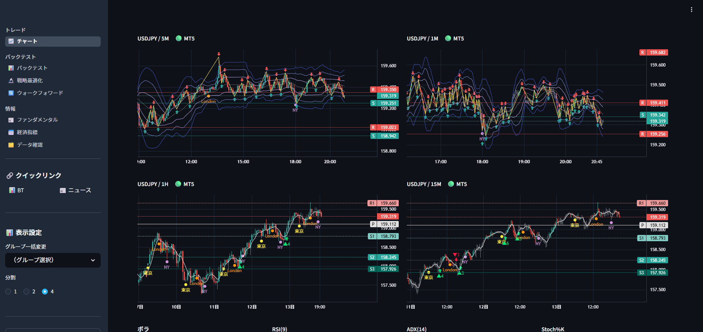
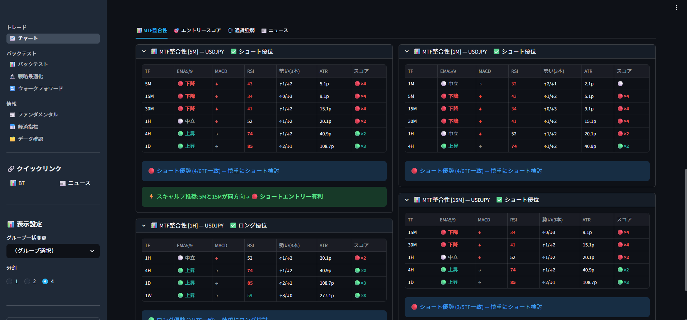
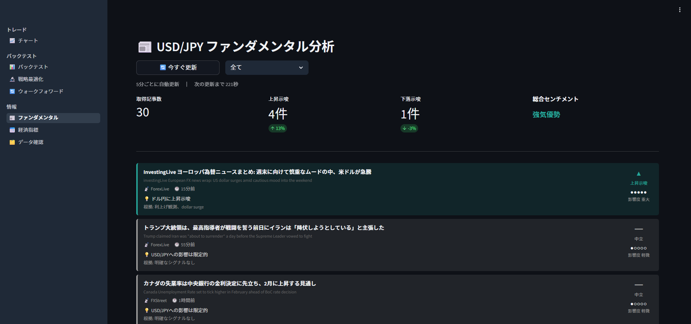

# FX Dashboard

MetaTrader 5 と連携した FX 取引分析プラットフォームです。
チャートのリアルタイム監視・テクニカル分析から、バックテスト・パラメータ最適化・ウォークフォワード分析まで、トレードの意思決定に必要な機能を Streamlit の Web UI で一元管理できます。

---

## 主な機能

| カテゴリ | 機能 |
|---|---|
| **チャート** | 1 / 2 / 4 分割リアルタイム表示、30+ インジケーター、エントリーシグナル、MTF 整合性パネル、エントリースコア、通貨強弱メーター |
| **バックテスト** | 40+ 戦略テンプレート、SL/TP 対応、20+ KPI 自動計算、損益曲線表示 |
| **戦略最適化** | パラメータグリッドサーチ、スコア自動計算、時間帯フィルター（東京・ロンドン・NY） |
| **ウォークフォワード分析** | IS/OOS 分割検証、Rolling / Anchored 両方式、過剰最適化度の定量評価 |
| **ファンダメンタル** | USD/JPY 関連ニュース自動取得・翻訳・センチメント分析（5 分ごと更新） |
| **経済指標カレンダー** | ForexFactory 連携、今週・来週のイベント表示、強弱自動判定 |
| **データ管理** | MT5 からのローカル保存、SQLite 差分更新、保存済みデータ統計 |

---

## スクリーンショット

### チャート画面





### ファンダメンタル画面



---

## 必要環境

| 項目 | バージョン |
|---|---|
| Python | 3.12.8 |
| pipenv | 最新版 |
| MetaTrader 5 | 任意（なくてもサンプルデータで動作） |
| OS | Windows 10/11（MT5 連携時）、macOS / Linux（サンプルデータのみ） |

> MT5 クライアントライブラリは Windows 専用です。MT5 を使用しない場合はサンプルデータで動作します。

---

## セットアップ

### 1. リポジトリをクローン

```bash
git clone https://github.com/your-username/fx.git
cd fx
```

### 2. 依存パッケージをインストール

```bash
pip install pipenv   # pipenv が未インストールの場合
pipenv install
```

### 3. 環境変数を設定（MT5 使用時のみ）

```bash
cp .env.example .env
```

`.env` を開いて MT5 のログイン情報を記入します。

```env
MT5_LOGIN=12345678
MT5_PASSWORD=your_password_here
MT5_SERVER=BrokerName-MT5
```

### 4. アプリを起動

```bash
pipenv run streamlit run app.py
```

ブラウザで `http://localhost:8501` を開くと起動します。

---

## ページ一覧

### トレード

#### 📈 チャート
MT5 または内蔵サンプルデータをリアルタイムで表示するメイン画面です。

- **1 / 2 / 4 分割レイアウト** — 複数通貨ペア・時間足を同時監視
- **通貨ペア一括変更** — サイドバーからグループ単位で全パネルを一括切り替え
- **インジケーター** — 各パネル独立で 30+ インジケーターを自由に組み合わせ
- **エントリーシグナル** — ADX・RSI・MACD・ATR・BB・EMA の複合判定で矢印マーカーを表示
- **市場状態バー** — RSI(9) / ADX(14) / Stoch%K を色コーディングでリアルタイム表示
- **MTF 整合性タブ** — 現在足から上位足まで EMA / MACD / RSI / 勢いをスコアリングし、整合性を判定
- **エントリースコアタブ** — 0〜100 点のスコアとロング/ショートの内訳を 5 秒ごと更新
- **通貨強弱タブ** — 8 通貨の相対強弱を棒グラフで表示し、推奨ペアを提示
- **ニュースタブ** — 影響度 3 以上のニュースを 5 分ごと表示
- **RR 計算ツール** / **ポジションサイズ計算** — サイドバーから即利用可能
- **ボラティリティ警告** — ATR が低すぎる・急拡大時に自動警告
- **高インパクト指標カウントダウン** — 経済指標発表まで 15 分以内で警告を表示

---

### バックテスト

#### 📊 バックテスト
単一戦略・単一パラメータでバックテストを実行します。

- **40+ 戦略テンプレート**（下記「対応戦略」参照）
- **SL / TP** — 固定 pips または ATR 倍率で指定
- **時間帯フィルター** — 東京・ロンドン・NY・任意時間帯でフィルタリング
- **損益曲線** — Plotly インタラクティブグラフ
- **トレード一覧** — 各トレードの詳細テーブル（色コーディング）
- **20+ KPI** — 下記「KPI 一覧」参照

#### 🔬 戦略最適化
パラメータをグリッドサーチし、スコアが高い組み合わせを自動発見します。

- 複数パラメータの全組み合わせを自動探索
- スコア式: `PF × 勝率 × log(件数+1)`（DD ペナルティあり）
- 上位 20 件をランキング表示
- 結果を CSV / JSON に出力可能

#### 🔄 ウォークフォワード分析
IS（最適化期間）と OOS（検証期間）に分割し、戦略の汎化性能を評価します。

- **Rolling / Anchored** 両方式に対応
- IS 期間で最適パラメータを自動探索 → OOS 期間で実績検証
- IS / OOS の勝率・PF・DD を期間ごとに比較
- 過剰最適化スコア（OOS PF / IS PF 比）を定量評価

---

### 情報

#### 📰 ファンダメンタル
USD/JPY に関連するニュースを自動収集・分析します。

- **5 ソース並列取得**（ロイター・ForexLive・DailyFX 等）
- **日本語翻訳** — deep-translator で自動翻訳
- **センチメント分析** — USD 強弱・JPY 強弱・影響度（1〜5）を自動判定
- **5 分ごと自動更新**

#### 📅 経済指標
ForexFactory 連携で今週・来週の経済指標カレンダーを表示します。

- High / Medium / Low のインパクト別フィルター
- 発表済みの結果に対して予想比で強弱を自動判定
- 対象通貨でフィルタリング可能
- 高インパクト指標のチャートマーカー表示（チャートページと連動）

#### 🗂️ データ確認
MT5 から取得した OHLCV データを管理します。

- **一括取得** — 通貨ペア × 時間足の全組み合わせを MT5 から一括保存
- **差分更新** — 最新データのみ追加取得（無駄なリクエストなし）
- **統計表示** — 通貨ペア × 時間足ごとの保存件数・最新日時を一覧表示

---

## 対応通貨ペア（28 種類）

| グループ | ペア |
|---|---|
| 円ペア | USDJPY, EURJPY, GBPJPY, AUDJPY, CADJPY, NZDJPY, CHFJPY |
| ドルペア | EURUSD, GBPUSD, AUDUSD, NZDUSD, USDCAD, USDCHF |
| クロスペア | EURGBP, EURAUD, EURCAD, EURCHF, GBPAUD, GBPCAD, GBPCHF, AUDCAD, AUDNZD, AUDCHF, NZDCAD, NZDCHF, CADCHF |

---

## 対応時間足

`1M` / `5M` / `15M` / `30M` / `1H` / `4H` / `1D` / `1W`

---

## インジケーター一覧

| 種別 | インジケーター |
|---|---|
| 移動平均 | SMA 5/10/20/50/200, EMA 5/10/20/50/200 |
| ボラティリティ | ボリンジャーバンド (20), VWAP |
| トレンド | MACD (12,26,9), レジサポライン, 直近高値/安値, ピボットポイント, ZigZag（転換点予測） |
| オシレーター | RSI (14), ストキャスティクス (5,3,3), ダイバージェンス (RSI) |
| パターン | ローソク足パターン |
| その他 | セッション区切り, エントリーシグナル |

---

## バックテスト対応戦略（40+）

<details>
<summary>戦略一覧を展開</summary>

### 単体インジケーター（15 種）
| 戦略名 | 概要 |
|---|---|
| SMA クロス | 短期・長期 SMA のゴールデン / デッドクロス |
| EMA クロス | 短期・長期 EMA のゴールデン / デッドクロス |
| RSI | 買われ過ぎ / 売られ過ぎからの反転 |
| MACD クロス | MACD とシグナル線のクロス |
| ボリンジャーバンド | バンド逆張り・バンドウォーク |
| ストキャスティクス | %K の買われ過ぎ / 売られ過ぎ逆張り |
| CCI | CCI ±100 超えからの反転 |
| ウィリアムズ %R | -80 / -20 の反転 |
| ドンチャンブレイクアウト | N 本高値 / 安値のブレイク |
| ATR ブレイクアウト | ATR 倍率でブレイク判定 |
| 移動平均乖離率 | 乖離率の過大時に逆張り |
| MACD ヒストグラム | ヒストグラムの向き変化 |
| トリプル EMA クロス | 短中長の 3 本 EMA の並び順 |
| ROC（変化率） | 変化率の ±閾値でシグナル |
| RSI トレンド | RSI の 50 ラインでトレンドフォロー |

### 複合インジケーター（8 種）
| 戦略名 | 概要 |
|---|---|
| RSI × MACD クロス | MACD クロス + RSI フィルター |
| EMA トレンド × RSI | EMA 方向 + RSI 反転のダブル確認 |
| BB × ストキャスティクス | BB バンドタッチ + Stoch 逆張り |
| SMA クロス × ATR フィルター | SMA クロス + ATR によるボラ確認 |
| RSI × BB | BB バウンス + RSI 中立から反転 |
| MACD × ドンチャン | ドンチャンブレイク + MACD 方向確認 |
| トリプル確認（EMA+RSI+MACD） | 3 指標同時一致 |
| Stoch × EMA トレンド | EMA トレンド方向 + Stoch 反転 |

### スキャルピング専用（3 種）
| 戦略名 | 概要 |
|---|---|
| 夜間スキャルパー | 夜間時間帯の 4 重確認エントリー |
| 夜間ブレイクアウト | BB 拡張 + 夜間時間帯のブレイク |
| 夜間押し目買い | EMA + RSI + ATR の 3 重確認 |

</details>

---

## KPI 一覧

| 項目 | 説明 |
|---|---|
| 総損益（円 / pips） | バックテスト期間の合計損益 |
| トレード数 | 総エントリー回数 |
| 勝率（%） | 利益トレード / 全トレード |
| 利益係数（PF） | 総利益 / 総損失 |
| 最大ドローダウン（%） | 資産曲線のピークからの最大下落率 |
| シャープレシオ | 収益の安定性（年率換算） |
| 回復係数 | 総損益 / 最大 DD |
| 連勝数 / 連敗数 | 最大連続勝ち / 負け回数 |
| 平均保有本数 | 1 トレードあたりの平均保有バー数 |
| 期待値（pips） | 1 トレードあたりの期待損益 |
| SL / TP ヒット数 | 各決済方法の回数 |
| リスク・リワード比 | 平均利益 / 平均損失 |

---

## プロジェクト構成

```
fx/
├── app.py                          # Streamlit エントリーポイント
├── Pipfile                         # 依存パッケージ管理
├── .env.example                    # 環境変数テンプレート
│
├── config/
│   ├── settings.py                 # 通貨ペア・時間足・共通定数
│   └── signal_defaults.py          # エントリーシグナルのデフォルトパラメータ
│
├── dashboard/
│   ├── pages/
│   │   ├── chart.py                # リアルタイムチャート画面
│   │   ├── backtest.py             # バックテスト実行画面
│   │   ├── optimize.py             # 戦略最適化画面
│   │   ├── walkforward.py          # ウォークフォワード分析画面
│   │   ├── news.py                 # ファンダメンタル分析画面
│   │   ├── calendar.py             # 経済指標カレンダー画面
│   │   └── data_viewer.py          # データ管理画面
│   │
│   ├── backtest_engine.py          # バックテスト実行エンジン
│   ├── optimizer.py                # パラメータグリッドサーチ
│   ├── walkforward.py              # ウォークフォワード分析エンジン
│   ├── indicators.py               # テクニカル指標計算・シグナル生成
│   ├── signal_score.py             # エントリースコア・通貨強弱計算
│   ├── chart_utils.py              # LightweightCharts JSON 生成
│   ├── sample_data.py              # MT5 / サンプルデータ取得
│   ├── news_utils.py               # ニュース取得・分析
│   ├── calendar_utils.py           # 経済指標取得・パース
│   └── ai_learner.py               # k-NN フィードバック蓄積
│
├── data/
│   ├── mt5_client.py               # MetaTrader 5 クライアント
│   ├── local_store.py              # SQLite OHLCV ストレージ
│   └── models.py                   # Pydantic データモデル
│
├── output/                         # バックテスト結果・ログ（.gitignore）
├── static/                         # チャート用動的 JSON（毎秒更新）
└── .streamlit/                     # Streamlit 設定・キャッシュ
```

---

## 技術スタック

| 層 | 技術 |
|---|---|
| UI フレームワーク | [Streamlit](https://streamlit.io/) |
| チャートライブラリ | [TradingView Lightweight Charts](https://tradingview.github.io/lightweight-charts/)（HTML/JS 埋め込み） |
| グラフ | [Plotly](https://plotly.com/python/) |
| データ処理 | pandas, numpy |
| DB | SQLite3 |
| MT5 連携 | [MetaTrader5](https://pypi.org/project/MetaTrader5/)（Windows 専用） |
| バリデーション | [Pydantic](https://docs.pydantic.dev/) |
| ニュース取得 | feedparser, deep-translator |

---

## 注意事項

- **MT5 は Windows 専用** です。macOS / Linux では MT5 連携は無効になりますが、内蔵サンプルデータでチャートやバックテストを利用できます。
- `output/`、`static/`、`data/ohlcv.db`、`.env` は `.gitignore` に含まれており、リポジトリには含まれません。
- バックテストの結果はあくまで過去データに基づくシミュレーションです。将来の利益を保証するものではありません。

---

## ライセンス

MIT License
